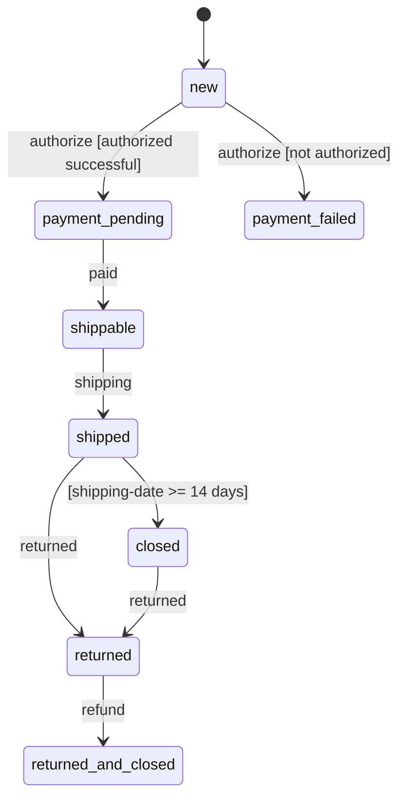
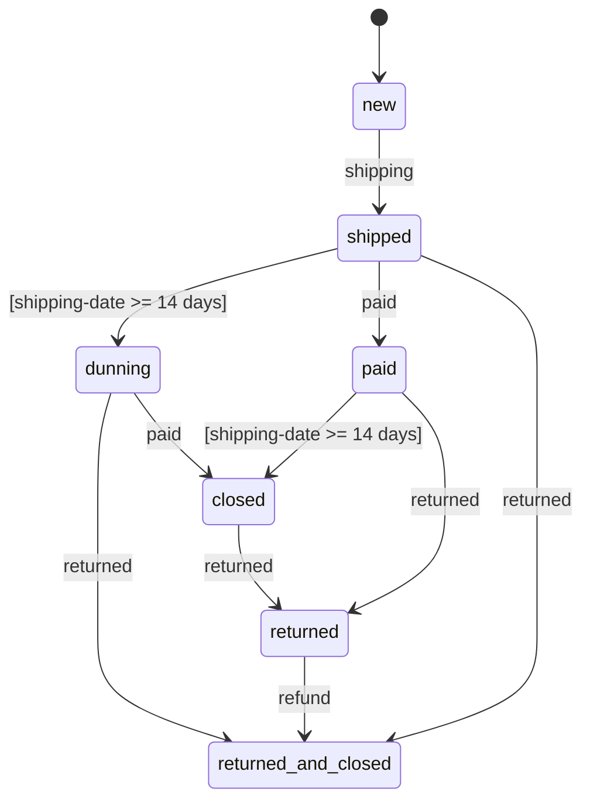

# finita-example

A working example of the [@camcima/finita](https://github.com/camcima/finita) state machine library, demonstrating order processing with two workflows: **prepayment** and **postpayment**.

## Overview

This example models an e-commerce order lifecycle where orders follow different state machine workflows depending on the payment method. It demonstrates:

- Defining states, transitions, and events
- Conditions (guards) with typed `TSubject` generics
- Composite conditions with `Not`
- Event observers (commands) for side effects
- Automatic transitions (no event trigger, condition-based)
- Graph visualization output (DOT and Mermaid formats)

## Workflows

### Prepayment

Orders are authorized before payment. Authorization can succeed or fail.



### Postpayment

Orders are shipped immediately. Payment is collected after delivery.



## Project Structure

```
src/
  index.ts                              # Main entry point - runs all orders through their workflows
  graph.ts                              # Graph visualization output (DOT/Mermaid)
  order/
    Order.ts                            # Order domain object with Statemachine<Order>
    StateConstants.ts                   # State name constants
    EventConstants.ts                   # Event name constants
    ProcessConstants.ts                 # Process name constants
    condition/
      AuthorizedSuccessful.ts           # Checks if authorization succeeded (via context)
      ShippingDateGreater14Days.ts      # Simulates a time-based condition
    command/
      Authorize.ts                      # Observer that runs authorization logic
    process/
      Prepayment.ts                     # Builds the prepayment process graph
      Postpayment.ts                    # Builds the postpayment process graph
```

## Running

```bash
# Install dependencies
npm install

# Run the example
npm start

# Generate graph output for a process
npm run graph                  # defaults to prepayment
npx tsx src/graph.ts postpayment
```

### Sample Output

```
=============================================================
all created orders have the status "new"
=============================================================
Order PREPAYMENT 1 has status new
possible events: authorize
-------------------------------------------------------------
Order POSTPAYMENT 1 has status new
possible events: shipping
-------------------------------------------------------------
=============================================================
now we are authorizing all orders if possible
=============================================================
Order PREPAYMENT 1 has status new
trigger event "authorize" on Order PREPAYMENT 1
Command "Authorize" was executed. Result: successful
Order PREPAYMENT 1 has status payment pending
trigger event "paid" on Order PREPAYMENT 1
Order PREPAYMENT 1 has status shippable
-------------------------------------------------------------
```

## Key Patterns Demonstrated

### Typed Conditions (TSubject generics)

Conditions implement `ConditionInterface<Order>`, giving type-safe access to the subject without casts:

```typescript
import type { ConditionInterface } from "@camcima/finita";
import { Order } from "../Order.js";

export class ShippingDateGreater14Days implements ConditionInterface<Order> {
  checkCondition(subject: Order, _context: Map<string, unknown>): boolean {
    return subject.getNumber() === "POSTPAYMENT 2"; // subject is typed
  }

  getName(): string {
    return "shipping-date >= 14 days";
  }
}
```

### Typed Statemachine

The `Order` class uses `Statemachine<Order>` for type-safe subject access:

```typescript
import { Statemachine, type StatemachineInterface } from "@camcima/finita";

export class Order {
  private readonly statemachine: StatemachineInterface<Order>;

  constructor(number: string, process: ProcessInterface) {
    this.statemachine = new Statemachine<Order>(this, process);
  }
}
```

### Conditional Transitions with Composite Guards

The prepayment workflow uses `Not` to create the inverse condition:

```typescript
const authorizeSuccessful = new AuthorizedSuccessful();
const authorizeFailed = new Not(authorizeSuccessful);

stateNew.addTransition(
  new Transition(paymentFailed, "authorize", authorizeFailed),
);
stateNew.addTransition(
  new Transition(paymentPending, "authorize", authorizeSuccessful),
);
```

### Automatic Transitions

Transitions without an event name fire automatically when their condition is true:

```typescript
// Fires automatically when shipping-date >= 14 days (no event needed)
shipped.addTransition(new Transition(closed, null, shippingDateGreater14Days));
```

## License

MIT
