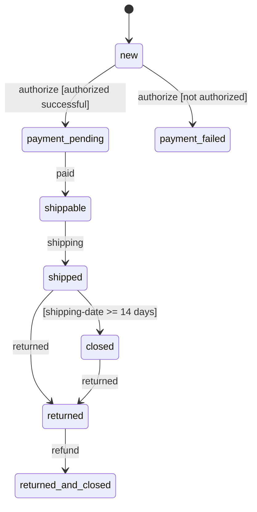
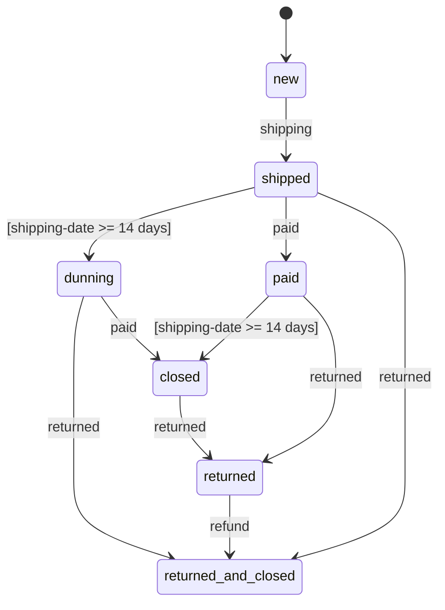

# finita-example

A working example of the [@camcima/finita](https://github.com/camcima/finita) state machine library (**v4**), demonstrating order processing with two workflows: **prepayment** and **postpayment**.

## Overview

This example models an e-commerce order lifecycle where orders follow different state machine workflows depending on the payment method. It demonstrates:

- **`ProcessBuilder`** — fluent, validated construction of a frozen, immutable process graph
- **Typed conditions (guards)** with `ConditionInterface<Order>` and the `Not` composite
- **Named event commands** implemented as `Observer`s (so they show up in graph output)
- **Automatic transitions** (no event trigger, condition-based)
- **After-transition observers** (typed, no casts): `StatefulStatusChanger`, `TransitionLogger`, and a custom observer using `frame.subject`
- **Graph visualization** output (DOT and Mermaid formats)

A second script (`npm run features`) isolates the headline features added/changed in v4:
**`ReentrancyError`**, **`maxAutomaticHops`** (`AutomaticTransitionCycleError`), the **`WeightTransition`** selector, the **`OnEnterObserver`** (chained events via `EnqueueContext`), and **composite conditions** (`AndComposite`/`Not`).

> Upgrading your own project from v2/v3? See the library's [migration guide](https://github.com/camcima/finita/blob/main/docs/migration/v2-to-v3.md). The biggest change is that `State`/`Transition`/`Process` are no longer constructed directly — everything goes through `ProcessBuilder`.

## Workflows

### Prepayment

Orders are authorized before payment. Authorization can succeed or fail.


```mermaid
stateDiagram-v2
    [*] --> new
    new --> payment_pending : authorize [authorized successful]
    new --> payment_failed : authorize [not authorized]
    payment_pending --> shippable : paid
    shippable --> shipped : shipping
    shipped --> closed : [shipping-date >= 14 days]
    shipped --> returned : returned
    closed --> returned : returned
    returned --> returned_and_closed : refund
```

### Postpayment

Orders are shipped immediately. Payment is collected after delivery.


```mermaid
stateDiagram-v2
    [*] --> new
    new --> shipped : shipping
    shipped --> dunning : [shipping-date >= 14 days]
    shipped --> paid : paid
    shipped --> returned_and_closed : returned
    dunning --> returned_and_closed : returned
    dunning --> closed : paid
    paid --> closed : [shipping-date >= 14 days]
    paid --> returned : returned
    closed --> returned : returned
    returned --> returned_and_closed : refund
```

## Project Structure

```
src/
  index.ts                              # Order-processing demo (npm start)
  features.ts                           # Isolated v4 feature demos (npm run features)
  graph.ts                              # Graph visualization output (DOT/Mermaid)
  order/
    Order.ts                            # Order domain object: Statemachine<Order> + observers
    StateConstants.ts                   # State name constants
    EventConstants.ts                   # Event name constants
    ProcessConstants.ts                 # Process name constants
    condition/
      AuthorizedSuccessful.ts           # Checks if authorization succeeded (via context)
      ShippingDateGreater14Days.ts      # Simulates a time-based condition
    command/
      Authorize.ts                      # Named Observer command for the "authorize" event
      Shipping.ts                       # Named Observer command for the "shipping" event
    observer/
      OrderAuditObserver.ts             # Typed AfterTransitionObserver (uses frame.subject)
    process/
      Prepayment.ts                     # Builds the prepayment process (ProcessBuilder)
      Postpayment.ts                    # Builds the postpayment process (ProcessBuilder)
```

## Running

```bash
# Install dependencies
npm install

# Run the order-processing demo
npm start

# Run the v4 feature spotlights
npm run features

# Generate graph output for a process
npm run graph                  # defaults to prepayment
npx tsx src/graph.ts postpayment
```

### Sample Output (`npm start`)

```
=============================================================
now we are authorizing all orders if possible
=============================================================
Order PREPAYMENT 1 has status new
  [command] "authorize" on Order PREPAYMENT 1 -> successful
  [info] Transition from "new" to "payment pending" with event "authorize" condition "authorized successful"
  [audit] Order PREPAYMENT 1: new -> payment pending (event "authorize")
Order PREPAYMENT 1 has status payment pending
  [info] Transition from "payment pending" to "shippable" with event "paid"
  [audit] Order PREPAYMENT 1: payment pending -> shippable (event "paid")
Order PREPAYMENT 1 has status shippable
-------------------------------------------------------------
```

The `[command]` line is the named event observer; `[info]` is the `TransitionLogger`; `[audit]` is the custom `OrderAuditObserver`. The `has status …` line reads the denormalized status kept in sync by `StatefulStatusChanger`.

## Key Patterns Demonstrated

### Building a process with `ProcessBuilder`

In v4, states and transitions are declared through the fluent, validated builder, which returns a frozen `Process`. There is no `new State()` / `new Transition()`.

```typescript
import { ProcessBuilder, Not } from "@camcima/finita";

const authorizeSuccessful = new AuthorizedSuccessful();
const authorizeFailed = new Not(authorizeSuccessful);

const process = new ProcessBuilder<Order>("prepayment")
  .addState("new", { initial: true })
  .addState("payment pending")
  .addState("payment failed")
  // Two transitions out of "new" on the same event, branching on the condition.
  .addTransition("new", "payment pending", {
    event: "authorize",
    condition: authorizeSuccessful,
  })
  .addTransition("new", "payment failed", {
    event: "authorize",
    condition: authorizeFailed,
  })
  // Automatic (eventless) transition: fires as soon as the condition holds.
  .addTransition("shipped", "closed", { condition: shippingDateGreater14Days })
  .build();
```

### Typed conditions (TSubject generics)

Conditions implement `ConditionInterface<Order>`, giving type-safe access to the subject without casts:

```typescript
import type { ConditionInterface } from "@camcima/finita";

export class ShippingDateGreater14Days implements ConditionInterface<Order> {
  checkCondition(subject: Order, _context: Map<string, unknown>): boolean {
    return subject.getNumber() === "POSTPAYMENT 2"; // subject is typed
  }

  getName(): string {
    return "shipping-date >= 14 days";
  }
}
```

### Event commands as named observers

Attach observers to a state's event after building. A named `Observer` (one with `getName()`) renders cleanly in graph output. The event arrives as `subject`; the invoke args are `[subject, context]`:

```typescript
import type { Observer, ObservableSubject } from "@camcima/finita";

export class AuthorizeCommand implements Observer {
  getName(): string {
    return "authorize-order";
  }

  update(_subject: ObservableSubject, args?: readonly unknown[]): void {
    const order = args?.[0] as Order;
    const context = args?.[1] as Map<string, unknown>;
    context.set("authorize result", /* ... */ "successful");
  }
}

process
  .getState("new")
  .getEvent("authorize")
  .attach(new AuthorizeCommand());
```

> For a quick, inline command without a name, the library's `CallbackObserver` spreads the invoke args straight into a callback: `new CallbackObserver((order, context) => { ... })`.

### After-transition observers (typed, no casts)

`Order` wires up three after-observers. In v4 the `TransitionFrame` carries the typed `subject`, so custom observers need no casts:

```typescript
import {
  Statemachine,
  StatefulStatusChanger,
  TransitionLogger,
} from "@camcima/finita";

this.statemachine = new Statemachine<Order>(this, process, {
  maxAutomaticHops: 50, // bound runaway automatic loops (default 100)
});

this.statemachine.attachAfter(new StatefulStatusChanger<Order>()); // syncs status
this.statemachine.attachAfter(new TransitionLogger<Order>(consoleLogger));
this.statemachine.attachAfter(new OrderAuditObserver()); // uses frame.subject
```

```typescript
// OrderAuditObserver — frame.subject is typed as Order, no cast needed
notify(frame: TransitionFrame<Order>, _ctx: EnqueueContext): void {
  const order = frame.subject;
  console.log(`${order.getName()}: ${frame.fromState.getName()} -> ${frame.toState.getName()}`);
}
```

### v4 feature spotlights (`npm run features`)

| Feature | What it shows |
| --- | --- |
| `AndComposite` / `Not` | Composing guards over a typed subject |
| `ReentrancyError` | Re-entering the machine from an observer is rejected (instead of deadlocking) |
| `maxAutomaticHops` | A runaway automatic loop is bounded with `AutomaticTransitionCycleError` |
| `WeightTransition` | Ambiguous transitions resolved deterministically by weight |
| `OnEnterObserver` | A chained event auto-fires on state entry via `EnqueueContext` |

## License

MIT
